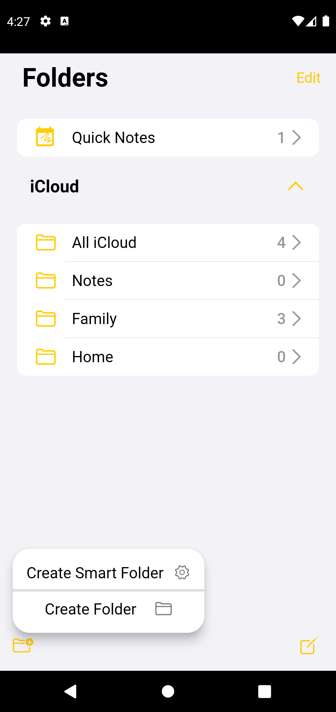
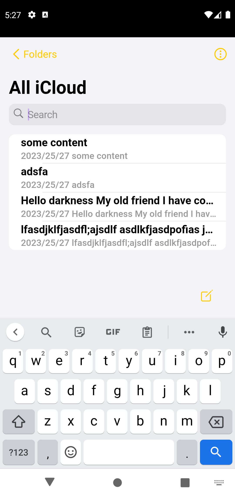
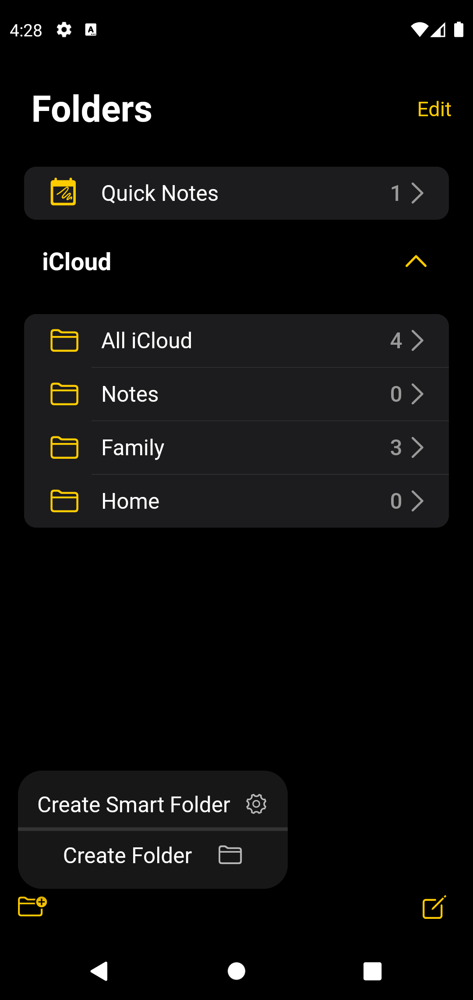
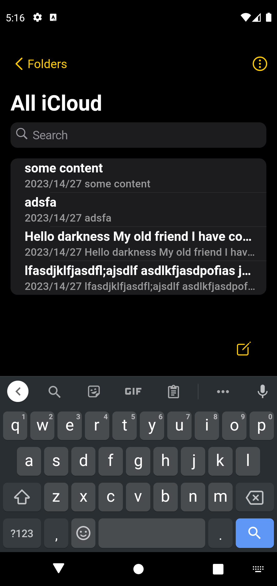

# Clone of the Apple Notes App
A Clone of the Notes app in the IOS ecosystem, built with flutter. 
- DarkMode support(app darkmode will be based on system dark mode by default)
- Create Folders 

For the folks at DurBean

[requirements.txt](requirements.txt)
I am unsure about what I should include in the requirements file. On research, I found it to be explicit for python projects. However, I have included the packages from pub.dev and the sdk that is used in this project.

## Samples

Light Mode

  
  

Dark Mode

  

## Tasks
- [X] Copy the UI one to one
- [X] add functionalities to the buttons(to the best of my abilities)
- [ ] Add, remove and rename folders
- [X] Rich Text Editor and controllers
- [ ] Make the edit page bottom bar buttons work
- [ ] Timeline view of Notes
- [ ] Filters system
- [ ] Add, remove notes 
- [ ] Update Existing Notes
- [ ] Animations(attention to details)